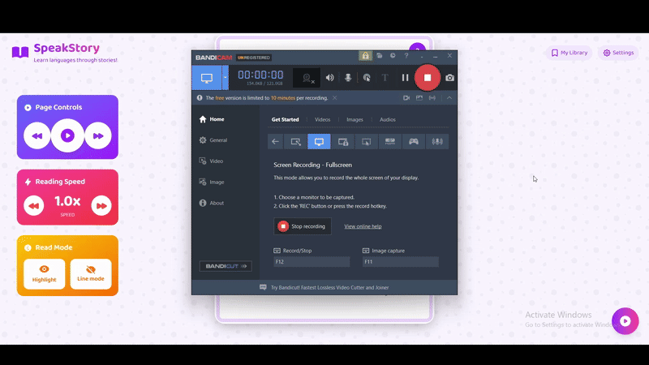

# 🇳🇱 The Dutch Ebook Reader

**The Dutch Ebook Reader** is a tool designed to help foreign children in the Netherlands learn Dutch more effectively. It does so by providing a **text-to-speech copilot** that guides them through pronunciation as they read.  

The app handles Dutch language PDFs and transforms them into speech-synchronized, sentence-aware reading material that young learners can follow easily.

---

## 🧠 Key Components

The system is made up of three main components:

- **PDF Converter** – Breaks down each PDF into individual pages and converts them into images.
- **Optical Character Recognition (OCR)** – Uses Tesseract to read text from each image and extract word positions.
- **Text-to-Speech Engine** – Synthesizes natural Dutch speech using Google Cloud's Text-to-Speech API, with proper sentence-level alignment.

---

## 🎾 The Application



## 📁 This Repository

This repo contains the **Backend API** code that handles PDF processing, OCR, text-to-speech, and data storage.

The frontend, which allows children to interact with the reader visually and aurally, is in a separate repository.

---

## 🔧 Dependencies & Installation

Before running the code, you’ll need to install the following dependencies:

### 1. Google Cloud Account Key

Used for accessing the Google Text-to-Speech API.

- Go to [Google Cloud Console](https://console.cloud.google.com/)
- Create a project and enable the **Text-to-Speech API**
- Generate a **service account key** (JSON) and download it
- Set an environment variable:  
  ```bash
  export GOOGLE_APPLICATION_CREDENTIALS=/path/to/your/key.json

## 📦 Dependencies Installation

### 2. Tesseract & PyTesseract (for OCR)

**Install Tesseract:**

  ```bash
  # Ubuntu
  sudo apt install tesseract-ocr
  

# macOS (using Homebrew)
brew install tesseract
Install PyTesseract (Python wrapper):


pip install pytesseract
```

### 3. Poppler (for PDF to image conversion)
**Install Poppler:**

```bash
# Ubuntu
sudo apt install poppler-utils

# macOS (using Homebrew)
brew install poppler
Install required Python package:
```

```bash
pip install pdf2image
```

## 📚 PDF Processing Pipeline
Each uploaded PDF is processed through the following steps:

**PDF → PNG Conversion**
The PDF is broken down into individual pages. Each page is saved as a .jpg image.

**OCR Text Extraction**
Each image is passed through OCR to extract text and bounding box data for every word.

**Text-to-Speech Generation**
Sentences are detected, annotated, and converted to speech. Timestamps are generated for sentence-level audio syncing.

## 📁 File Structure
Each processed PDF is saved under the /PREPROCESSED directory, organized like so:

```pgsql
/PREPROCESSED
  /[PDF_NAME]
    /PAGE1
      Page.jpg
      Text.txt
      boxMappings.json
      labelledBoxMappings.json
      markedText.txt
      speech.mp3
      timeStamps.json
```


**📄 Page.jpg**

The full image of the page after PDF conversion.


**📄 Text.txt**
Plaintext output of the OCR pass over the page image.


**📄 boxMappings.json**
Contains a list of all words detected by OCR, along with their bounding box positions in [x, y, width, height] format.

```json

[
  {
    "word": "Jip",
    "position": [129, 673, 191, 119]
  }
]
```


**📄 labelledBoxMappings.json**
Adds a "class" attribute to associate each word with its line.
Used to control read-aloud sequencing (line-by-line rather than word-by-word).

```json
[
  {
    "word": "Jip",
    "position": [129, 673, 191, 119],
    "class": "line0"
  }
]
```


**📄 markedText.txt**
Contains the full page text broken down into annotated sentences (used for pausing and syncing audio).
These sentences align with lines defined in labelledBoxMappings.json.


**📄 speech.mp3**
The TTS-generated audio file of the page being read aloud, sentence by sentence.


**📄 timeStamps.json**
List of timestamps representing the starting time (in seconds) of each sentence in speech.mp3.

```json
[
  {
    "sec": 0.014999999664723873,
    "name": "sentence0"
  }
]
```


## 💬 Summary
This backend pipeline powers the Dutch Ebook Reader by transforming static PDFs into an immersive, educational reading experience for kids.

With sentence-level audio and precise text mappings, it gives children the tools to understand and pronounce Dutch more effectively.
